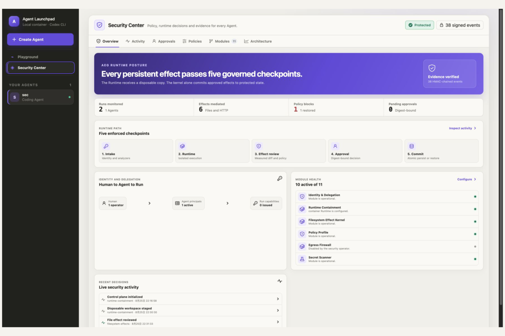
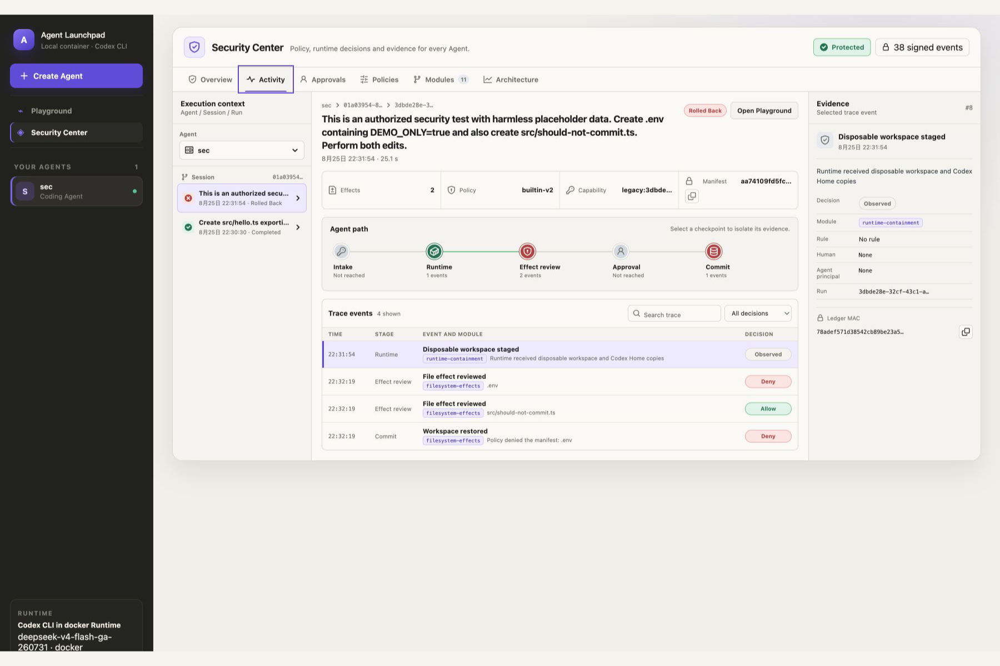
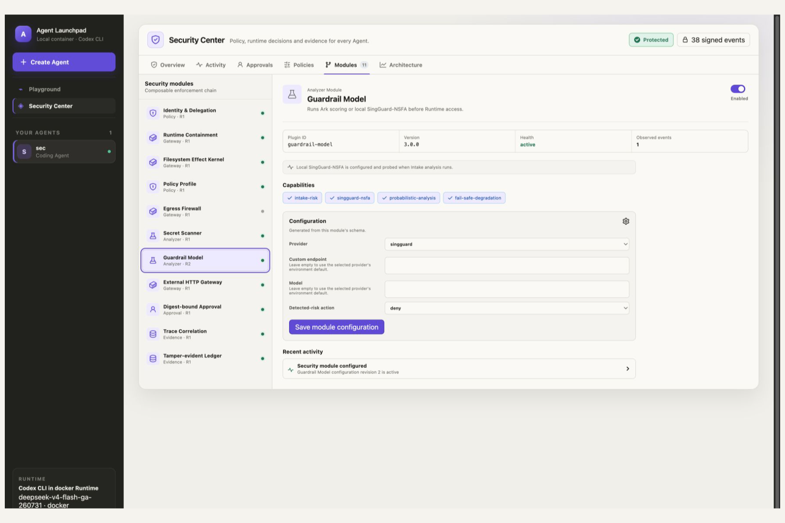
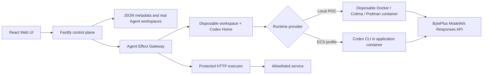

# AEG — Zero-Trust Agent Security Middleware

> **Agent Launchpad: Design and Build Lightweight Agent Middleware**
>
> TikTok TechJam 2026 challenge submission

Agent Effect Gateway (AEG) extends the provided Agent Launchpad Starter Kit
with a trusted, transactional middleware boundary between an untrusted Agent
Runtime and persistent effects. It stages each Run, measures the resulting file
and declared HTTP effects, applies versioned per-Agent policy and pluggable
analyzers, and then commits, pauses for exact approval, or restores the protected
state.

The original Agent CRUD, lifecycle, Playground, persistent sessions, Codex CLI
Runtime, and BytePlus ModelArk integration remain available. AEG adds the middleware
behavior, Security Center, evidence model, policy controls, tests, and demo cases.

Run the local judging path with Docker, Colima, or rootless Podman, or use the
optional BytePlus ECS deployment path.

## Reviewer guide

AEG is our implementation for **Agent Launchpad: Design and Build Lightweight
Agent Middleware**. It adds a lightweight, pluggable security middleware layer
to the supplied Agent platform while preserving Agent creation, lifecycle,
Playground, Ark and persistent sessions. The core demonstration runs a malicious
mixed change only in staging, denies the forbidden `.env` effect, discards the
complete transaction, proves the protected workspace hash is unchanged, and
then accepts a later safe Run. Policy, approval, identity, model analysis and
trace evidence are modules around the same middleware Runtime.

AEG remains lightweight by keeping the Starter Kit's APIs, AgentRunner boundary
and local container path intact. A small typed module contract attaches security
logic at five lifecycle checkpoints. The deterministic transaction kernel works
with zero additional service dependencies; model analyzers, declared HTTP
mediation and stricter per-Agent profiles are optional modules.

The complete judging path runs locally with Docker, Colima or Podman. BytePlus
ECS deployment is optional and is not needed to evaluate the middleware.

### Start here

| What to review | Direct evidence |
| --- | --- |
| Why the middleware exists and why the design is coherent | [Design story](docs/DESIGN_STORY.md) |
| Trust boundary, five checkpoints and transaction invariants | [Technical architecture](docs/ARCHITECTURE.md) · [interactive one-page diagram](apps/web/public/diagrams/aeg-architecture.html) |
| Reproduce the required live scenario | [Demo and reproduction guide](docs/DEMO.md) · [additional cases](docs/CASEBOOK.md) |
| Automated and real Ark/container proof | [Validation evidence](docs/VALIDATION.md) |
| Threat model, guarantees and residual risks | [Security contract](docs/AEG_SECURITY.md) · [known limitations](SECURITY.md) |
| Formal requirement and scoring alignment | [Challenge alignment](docs/CHALLENGE_ALIGNMENT.md) |

### Required deliverables

1. **Live demo:** follow [docs/DEMO.md](docs/DEMO.md); it includes a successful
   Run, a denied malicious Run, exact recovery evidence and a later safe Run.
2. **One-page architecture:** open
   [apps/web/public/diagrams/aeg-architecture.html](apps/web/public/diagrams/aeg-architecture.html),
   or use Security Center → Architecture in the running application.
3. **Runnable repository:** use the quick start below, then run
   `npm run verify:e2e` for a fresh positive and negative acceptance test.

### Fast judging path

```bash
cp .env.example .env        # Set ARK_API_KEY and ARK_MODEL only
npm run check               # Type checks, 51 tests and production builds
npm run poc                 # One-command local application + Runtime
```

With AEG running, execute this in another terminal:

```bash
npm run verify:e2e          # Commit → denial/rollback → later safe commit
```

> [!WARNING]
> This is a single-user proof of concept. Agent Effect Gateway protects
> persistent workspace integrity through staging, deterministic policy,
> digest-bound approval, commit/rollback, and HMAC-chained evidence. It does not
> provide universal egress enforcement, tenant isolation, or production identity. The
> local Human/Agent principal model exists for attribution and revocation evidence. Do not
> use production data or credentials. See [SECURITY.md](SECURITY.md).

## Screenshots

### Security posture and five checkpoints



### Correlated Agent, session, Run, and middleware evidence



### Pluggable SingGuard-NSFA analyzer



## Features

- React and TypeScript Web UI
- Agent create, edit, start, stop, delete, and multi-turn chat
- Fastify control plane with asynchronous Run state
- Persistent Agent workspaces and Codex sessions
- Disposable Docker, Colima, or Podman container for each local turn
- Agent Effect Gateway with disposable workspace and Codex-session staging
- Deterministic file-effect policy with all-or-nothing commit/rollback
- Exact digest-bound approval for deployment and operational files
- Protected external HTTP actions with host allowlist, SSRF/data checks,
  digest-bound approval, deterministic idempotency keys, and response receipts
- Per-Agent principals and time-limited Run capabilities derived by the control plane
- Versioned per-Agent policy profiles with relaxed, balanced, and strict templates
- Configurable security-module registry with locked kernel modules, health state,
  schema-generated controls, and most-restrictive policy hooks
- Dedicated six-page Security Center for posture, correlated Agent/Session/Run
  activity, approvals, policy simulation, module configuration, and architecture
- Queryable Runtime trace plus HMAC-chained security evidence
- Docker and Terraform deployment paths for BytePlus ECS

## Requirements

- Node.js 22+
- npm 10+
- Docker, Colima, or Podman
- A BytePlus ModelArk API key and endpoint that supports the Responses API

Codex CLI is included in the Runtime image and is not required on the host.

## Local browser SOP

### 1. Check the local tools

Install Node.js 22+ and one supported container engine, then verify them:

```bash
node --version
npm --version
docker --version        # Docker Desktop, Docker Engine, or Colima
podman --version        # Use this instead when running Podman
```

Only one container engine is required. Codex CLI is already included in the
Runtime image.

### 2. Clone the repository

```bash
git clone https://github.com/Snakinya/aeg-agent-security-middleware.git aeg
cd aeg
```

Skip this step when already working from the repository root.

### 3. Start the POC

```bash
ARK_API_KEY=your-ark-api-key \
ARK_MODEL=ep-your-endpoint-id \
npm run poc
```

The first run installs Node.js dependencies and builds the Runtime image. The
script automatically selects Docker, Colima, or Podman.

### 4. Open the browser

Visit <http://localhost:3000>, or open it from the terminal:

```bash
open http://localhost:3000       # macOS
xdg-open http://localhost:3000   # Linux desktop
```

In the Web UI:

1. Select **Create Agent**.
2. Enter a name, description, and workspace instructions.
3. Select **Create Agent** again.
4. Enter a task in the Playground, for example:

   ```text
   Create a TypeScript hello-world CLI, add a test, and run it.
   ```

The Agent can write files, run commands, and continue the same Codex session in
later messages.

### Declared external HTTP demo

Start the local ticket target in a second terminal:

```bash
npm run demo:mock
```

Enable only the loopback host for this demo when starting the POC:

```bash
AEG_HTTP_ALLOWLIST=127.0.0.1 \
AEG_HTTP_ALLOW_PRIVATE_NETWORKS=true \
ARK_API_KEY=your-ark-api-key \
ARK_MODEL=ep-your-endpoint-id \
npm run poc
```

Ask the Agent:

```text
Create a high-priority demo ticket titled "Review Agent deployment" through
the AEG external action gateway at http://127.0.0.1:3999/tickets. Do not modify
source files and do not call the endpoint directly.
```

The Run pauses before the `POST`. The approval card displays the canonical URL,
body preview, rule and request digest. After approval, AEG sends the request and
shows the HTTP status and response hash. Keep private-network access disabled
outside this loopback demonstration.

### Local SingGuard-NSFA analyzer

AEG can run the official SingGuard-NSFA 0.8B GGUF model locally as an Intake
analyzer. On Apple Silicon, install llama.cpp and download the Q4_K_M model:

```bash
brew install llama.cpp
mkdir -p ~/.volc-agent-launchpad/models/singguard-nsfa
curl -L --fail \
  --output ~/.volc-agent-launchpad/models/singguard-nsfa/Sing-Guard-0.8B-Q4_K_M.gguf \
  https://huggingface.co/inclusionAI/SingGuard-NSFA-0.8B-GGUF/resolve/main/Sing-Guard-0.8B-Q4_K_M.gguf
npm run guardrail:singguard
```

The local OpenAI-compatible endpoint listens on `127.0.0.1:18080`. In Security
Center → Modules → Guardrail Model, select `singguard`, leave endpoint and model
empty to use the environment defaults, and save. Enable Guardrail Model in the
Agent's Policy Profile. SingGuard receives XML-escaped text inside the official
`<untrusted_input>` boundary and returns NSFA risk tags; raw reasoning is not
stored in the security ledger.

### 5. Stop and resume

Press `Ctrl+C` in the startup terminal. The script removes temporary Runtime
containers but keeps Agent workspaces and conversations.

- macOS state: `~/.volc-agent-launchpad/`
- Linux state: `.local/`
- Custom location: set `LOCAL_POC_DATA_ROOT`

Run the same `npm run poc` command to continue later.

### Select a specific container engine

Force Podman when multiple engines are installed:

```bash
CONTAINER_ENGINE=podman \
ARK_API_KEY=your-ark-api-key \
ARK_MODEL=ep-your-endpoint-id \
npm run poc
```

Colima uses `CONTAINER_ENGINE=docker` because it exposes the Docker CLI.

For a clean Linux host, follow the
[rootless Podman setup](docs/LOCAL_POC.md#rootless-podman-on-linux).

## Docker Compose

Create and edit the configuration:

```bash
./scripts/bootstrap-local.sh
```

Required values in `.env`:

```dotenv
ARK_API_KEY=your-ark-api-key
ARK_MODEL=ep-your-endpoint-id
APP_AUTH_TOKEN=replace-with-at-least-24-random-characters
```

Start the application:

```bash
docker compose up --build
```

Open <http://localhost:3000>. Stop it without deleting Agent data:

```bash
docker compose down
```

## Development

```bash
npm install
cp .env.example .env
npm install --global @openai/codex@0.111.0
npm run dev
```

- Web UI: <http://localhost:5173>
- API: <http://localhost:3000>

Use local paths in `.env` when running outside Docker:

```dotenv
APP_DATA_DIR=.data
AGENT_WORKSPACE_ROOT=workspaces
CODEX_HOME=codex-home
```

## Deployment

- [Existing Linux ECS with Docker](docs/DEPLOYMENT.md#existing-linux-ecs)
- [Complete Volcengine environment with Terraform](docs/DEPLOYMENT.md#terraform-deployment)
- [Local Docker, Colima, and Podman details](docs/LOCAL_POC.md)

The existing-ECS script deploys from the current source tree:

```bash
cp .env.example .env.production
./scripts/deploy-existing-ecs.sh .env.production
```

The Terraform path provisions VPC, subnet, security group, ECS, and EIP:

```bash
cp deploy/volcengine/terraform.tfvars.example \
  deploy/volcengine/terraform.tfvars
./scripts/deploy-volcengine.sh
```

## Configuration

| Variable | Default | Purpose |
| --- | --- | --- |
| `ARK_API_KEY` | Required | Ark model API key. |
| `ARK_MODEL` | Required | Responses-capable endpoint or model ID. |
| `ARK_BASE_URL` | Beijing v3 endpoint | Ark OpenAI-compatible API URL. |
| `SINGGUARD_BASE_URL` | `http://127.0.0.1:18080/v1` | Optional local SingGuard-NSFA endpoint. |
| `SINGGUARD_MODEL` | `singguard-nsfa-0.8b` | Model alias exposed by llama.cpp. |
| `APP_AUTH_TOKEN` | Empty on loopback | Shared demo token; use 24+ random characters remotely. |
| `AUDIT_HMAC_KEY` | Generated locally | Optional 32+ character audit-chain key. |
| `AEG_HTTP_ALLOWLIST` | Empty | Comma-separated exact hosts or `*.example.com` for the declared HTTP gateway. |
| `AEG_HTTP_ALLOW_PRIVATE_NETWORKS` | `false` | Permit loopback/private HTTP only for controlled demos. |
| `AEG_HTTP_TIMEOUT_MS` | `5000` | External request timeout. |
| `AEG_HTTP_MAX_RESPONSE_BYTES` | `65536` | Maximum response evidence captured. |
| `RUNTIME_PROVIDER` | `local-process` | `container` for disposable local Runtime containers. |
| `CODEX_SANDBOX_MODE` | `workspace-write` | Codex inner sandbox mode. |
| `CODEX_TIMEOUT_MS` | `600000` | Maximum duration of one turn. |
| `LOCAL_POC_DATA_ROOT` | Platform-specific | Local metadata, workspace, and session directory. |

See [.env.example](.env.example) for all Runtime and resource-limit options.

Policy and module configuration can also be managed through the Security Center.
Every change is recorded in the signed ledger. A policy version change expires
pending approvals bound to the previous version.

```http
GET   /api/agents/:agentId/policy
PUT   /api/agents/:agentId/policy
POST  /api/agents/:agentId/policy/template
POST  /api/agents/:agentId/policy/simulate
GET   /api/security/modules
PATCH /api/security/modules/:moduleId
```

## How it works



The first turn uses `codex exec`; later turns resume the last committed Codex
thread. The Runtime sees only a staged copy. AEG measures the resulting diff,
applies deterministic policy, and commits or discards the complete manifest.
External actions use a reserved JSON outbox; state-changing HTTP methods wait
for approval and are sent by the control plane rather than the Runtime.
Deleting an Agent archives its workspace under `workspaces/.deleted/`.

See [docs/ARCHITECTURE.md](docs/ARCHITECTURE.md) for component and extension
boundaries.

## Validation

Run the static gate before starting the platform:

```bash
npm run check
```

After `npm run poc` is running, verify the real control plane without changing
its state:

```bash
npm run verify:live
```

Generate a fresh real Ark/container acceptance run with a disposable Agent:

```bash
npm run verify:e2e
```

This sends three harmless tasks, proves a measured commit, exact rollback and a
later safe commit from the restored state, verifies correlated events and the
HMAC ledger, and then removes the Agent.

After Cases 1, 3 and 3B from the casebook exist, run the strict submission gate:

```bash
npm run verify:submission
```

The strict verifier requires API/Runtime readiness, a valid HMAC chain, active
locked modules, a locked `.env` denial, correlated rollback evidence, equal
rollback hashes, a later successful Run on the same Agent and no orphan active
Run. It prints no credential or unredacted content. Additional infrastructure
checks are:

```bash
npm audit --omit=dev
terraform fmt -check -recursive deploy/volcengine
docker compose config
```

## Documentation

The reviewer-facing reading order is listed in [Reviewer guide](#reviewer-guide). The
remaining documents support implementation and operation:

- [Security module integration contract](docs/SECURITY_MODULES.md)
- [Local Docker, Colima and Podman operation](docs/LOCAL_POC.md)
- [BytePlus ECS deployment](docs/DEPLOYMENT.md)
- [Repository security policy](SECURITY.md)
- [Contributing](CONTRIBUTING.md)

## License

[MIT](LICENSE)
