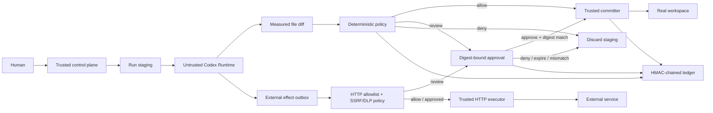

# Agent Effect Gateway

Agent Effect Gateway (AEG) is the security middleware implemented in this
repository. It treats the model, Runtime, workspace instructions, generated
commands, and Runtime-reported trace as untrusted.

## Threat model

### Protected assets

- the persistent Agent workspace and committed Codex session state;
- environment, VCS and platform metadata inside the governed workspace boundary;
- approval authority and policy configuration;
- integrity and confidentiality of stored security evidence;
- declared external HTTP targets and request bodies.

### Adversary capabilities considered

An attacker may influence a prompt, repository instruction or model output; ask
the Runtime to mix safe and prohibited changes; falsify or omit Runtime trace;
replace staged content after a human reviews it; race the real workspace; submit
unsafe paths or links; request an external destination; or cause an analyzer,
Runtime or HTTP target to fail.

The model excludes a malicious host administrator, kernel/container escape,
production cross-tenant identity compromise and arbitrary Runtime egress. The
POC records these as residual risks instead of presenting unsupported controls.

| Threat | Implemented control | Failure/recovery evidence | Residual risk |
| --- | --- | --- | --- |
| Prompt injection causes a forbidden write | Measured effects, locked hard-deny and complete-manifest rollback | `.env` mixed Run; equal before/after hashes | Runtime may still perform ungoverned network traffic |
| Runtime lies in its trace | Trace is evidence only; policy uses control-plane diff | Trace correlation/mismatch tests | Kernel/host compromise is excluded |
| Approval content is replaced | Canonical digest, policy version, before-state and TTL revalidation | Digest-replacement test | Human may approve genuinely dangerous exact content |
| Plug-in weakens policy | Tightening-only precedence and locked kernel modules | Registry tests and live verifier | A buggy module may over-block availability |
| Path or link escapes the workspace | Canonical relative paths, symlink/hardlink rejection | Negative filesystem tests | Container escape is excluded |
| External request reaches an unsafe target | Platform allowlist, Agent subset, SSRF/method/header/body rules | HTTP negative tests and simulator | Universal L3 egress is not implemented |
| Classifier is unavailable or wrong | Visible degradation; deterministic controls remain authoritative | SingGuard degradation tests/events | Probabilistic false positives/negatives remain |
| Audit file is edited | HMAC chain verification and degraded posture | Ledger mutation test | Same-host key is not host-admin resistant |
| Commit partially fails | Pre-commit snapshot, restore and final hash verification | Partial-apply recovery test | Remote services need separate compensation |

## Modular middleware contract

`SecurityModuleRegistry` is the stable extension seam. Each module declares an
ID, version, kind, capabilities, lock state, optional JSON configuration schema
and runtime health. Modules may inspect Intake, observe the shared redacted event
stream, and contribute a stricter Effect decision. A
module can upgrade `allow` to `require_approval` or `deny`; it cannot downgrade
an existing decision. Active module IDs and versions form the policy version
bound into approvals.

Built-in modules cover identity and delegation, Runtime containment, per-Agent
policy, secret scanning, local SingGuard-NSFA or Ark analysis, filesystem effects,
external HTTP, approval, trace correlation and the audit ledger. Additional
content, MCP, database, memory or provider guards can use
the same contract without editing `AgentService` orchestration.

## Identity and delegation

The local POC provisions a distinct principal for every Agent. The trusted
control plane derives a time-limited Run capability from the Agent owner,
allowed workspace and declared HTTP scope. Stop revokes the Agent principal;
every terminal Run revokes its capability. Approval records the Human actor.
This produces real attribution and revocation evidence, while production login,
multi-user credentials and tenant authorization remain declared extensions.

## Implemented security contract

AEG protects persistent workspace integrity and mediates declared external HTTP
actions for each Run:

```text
Intake → Runtime → Effect Review → Approval → Execute / Commit / Rollback
```

1. The control plane copies the Agent workspace and its committed Codex Home to
   a Run-specific staging directory.
2. Codex receives only those staged paths.
3. After Codex exits, AEG hashes the real and staged trees and creates a
   canonical file-effect manifest.
4. A versioned per-Agent profile and deterministic built-in policy evaluate every
   effect. The most restrictive
   decision applies to the complete manifest.
5. Ordinary source changes commit automatically. Sensitive operational changes
   wait for a human decision bound to the exact manifest digest.
6. Denial, expiry, cancellation, digest mismatch, and commit failure discard the
   staged state. A pre-commit snapshot restores partial file application.
7. The Codex thread pointer and staged Codex Home advance only after commit.
8. An Agent requests an external action by writing one request to
   `.aeg/external-effects.json`. The Runtime does not receive the HTTP response
   directly and the outbox is never committed to the real workspace.
9. The trusted gateway validates the destination, method, headers, body and
   network class. It sends an approved request with a deterministic idempotency
   key and records a response receipt.



## Built-in policy

| Resource | Decision |
| --- | --- |
| `.git/**`, `.launchpad/**`, `AGENTS.md`, real `.env` variants | Deny |
| `.github/workflows/**`, `infra/**`, `Dockerfile`, Compose files | Require approval |
| Other files inside the Agent workspace | Allow |
| Allowlisted external `GET` | Allow |
| Allowlisted external `POST`, `PUT`, `PATCH` | Require approval |
| External `DELETE`, credentials, secret-like fields, unknown headers | Deny |
| Host outside allowlist, private network by default, non-HTTPS public URL | Deny |
| File changes mixed with an external request | Deny |

`.env.example`, `.env.sample`, and `.env.template` remain usable for normal
development. Policy loading failure is fail-closed because no external policy
file participates in the POC decision path.

Per-Agent HTTP host rules form a subset of `AEG_HTTP_ALLOWLIST`. A profile can
tighten the platform boundary but cannot authorize a new destination. The
Policies simulator evaluates both layers and reports the stricter result.

## Approval binding

The approval UI shows every file and external effect and the SHA-256 digest of
the canonical combined manifest. Approval succeeds only when all conditions
still hold:

- approval is pending and within its 15-minute TTL;
- policy version matches;
- real workspace before-state has not changed;
- staged paths, operations, sizes, and content hashes produce the same digest.
- external method, canonical URL, allowed header names, body hash and request
  digest remain identical.

Changing `Dockerfile` after review causes approval to expire and the complete Run
to roll back.

## Evidence

Run responses include measured effects, decisions, policy rules, digest,
workspace before/after hashes, and untrusted Runtime trace events. Run history
keeps prior normal, approval and rollback evidence accessible. The ledger
endpoint verifies an HMAC-SHA256 chain:

Executed HTTP effects additionally include status code, response content type,
captured byte count, response hash, truncation flag and execution timestamp.
JSON previews redact secret-like response fields; non-JSON bodies are hidden.
Timeout and network failures are marked `uncertain`; the UI warns against blind
retry because a remote service may already have applied the request.

```http
GET /api/ledger/verify
GET /api/security/overview
GET /api/security/events
GET /api/identity
```

The Security Center provides Overview, Activity, Approvals, Policies, Modules and
Architecture pages. Activity correlates Agent, committed Codex session, Run,
Human/Agent identity, checkpoint events, modules and measured effects. The
Playground keeps action-time warnings and links to the complete operator view.

The default audit key is generated under `APP_DATA_DIR/security/ledger/audit.key`.
Set `AUDIT_HMAC_KEY` in managed deployments. The key and chain live on the same
host in this POC; external WORM storage or KMS signing is required to defend
against a compromised host administrator.

## Approval API

```http
GET  /api/approvals?status=pending
GET  /api/approvals/:approvalId
POST /api/approvals/:approvalId/approve
POST /api/approvals/:approvalId/deny
```

## Demo

Use one ordinary task and three security cases:

1. Ask the Agent to create `src/hello.ts`. It commits without a prompt.
2. Ask it to create a `Dockerfile`. The real workspace remains unchanged until
   the exact manifest is approved.
3. Ask it to write `.env`. The manifest is denied and the Run is rolled back.
4. Start `npm run demo:mock`, allowlist `127.0.0.1`, and ask the Agent to create
   a ticket through `http://127.0.0.1:3999/tickets`. The request count remains
   zero until the exact external manifest is approved; the terminal Run shows
   the HTTP receipt.

The automated suite also modifies staged content after approval is requested and
verifies that digest binding rejects the replacement. Rollback tests require the
real workspace before and after hashes to match exactly.

## Current boundary

- The transaction kernel covers filesystem effects and Codex session state.
- The declared-action HTTP gateway implements an allowlist, SSRF checks,
  secret-bearing input denial, digest-bound approval, idempotency key and
  response evidence.
- Runtime outbound network access remains open for Ark. The HTTP guarantee applies
  to actions declared through the gateway; it does not claim universal egress
  interception or data-loss prevention.
- Runtime containers are a development isolation layer, not hardened tenant
  isolation.
- The JSON store supports one control-plane process.
- Empty-directory and file-mode-only changes are not represented as effects.
- The local Human principal is an attribution and delegation fixture, not
  production authentication or tenant authorization.
- SingGuard-NSFA is a configurable probabilistic Intake signal. When unavailable,
  the module reports degraded and deterministic controls continue.
