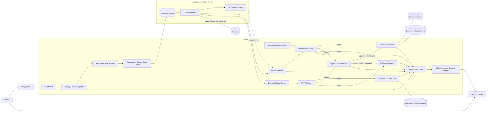

# Zero-Trust Agent Effect Gateway Architecture

Agent Effect Gateway (AEG) is a trusted mediation layer around the existing
Codex Runtime. Its security contract covers persistent workspace and committed
Codex-session integrity, plus external HTTP actions declared through AEG. A
typed module registry, Run-scoped delegation, and one security-event contract
make the enforcement and evidence planes independently extensible.

Open the [interactive one-page AEG v3 architecture](../apps/web/public/diagrams/aeg-architecture.html)
for the submission diagram, trace animation, light/dark themes and export. Its
validated Archify source is [diagrams/aeg-v3-architecture.json](diagrams/aeg-v3-architecture.json).

## Trust boundary and data flow



The Runtime never receives the real workspace path or committed Codex Home.
Runtime trace is untrusted evidence. Enforcement uses hashes and filesystem
facts measured by the control plane. External requests are canonicalized from a
reserved outbox; the trusted executor sends them only after policy and approval.

## Five-checkpoint protocol

```text
Intake
  → Runtime
  → Effect Review
      → Approval
  → Execute / Commit

queued
  → running
  → reviewing_effects
      → committing → completed
      → awaiting_approval → committing → completed
      → awaiting_approval → rolling_back → rolled_back
      → rolling_back → rolled_back
```

Every Run follows this protocol:

1. Hash the real workspace and create Run-specific workspace and Codex Home
   copies under `APP_DATA_DIR/security/staging`.
2. Confirm that the staged baseline hash equals the real before-hash.
3. Execute Codex against staged paths only.
4. Hash both trees and create a canonical create/modify/delete Effect Manifest.
5. Parse at most one `.aeg/external-effects.json` request and create a canonical
   HTTP Effect containing the method, URL, header names, body hash and digest.
6. Reject a Run that mixes ordinary file changes with an external request. This
   avoids claiming atomicity across a filesystem and a remote service.
7. Apply built-in policy and every active module contribution. Intake analyzers
   have already recorded allow, review, deny or degraded evidence. Extensions may
   tighten a decision but cannot relax an earlier decision. Any deny rolls back
   the complete manifest; any review decision pauses it.
8. Bind approval to the combined manifest digest, policy version, TTL, and real
   before-state. Recalculate it immediately before applying effects.
9. Reject links and unsafe path components, snapshot real state, apply files,
   verify the final tree, and promote the staged Codex Home.
10. For an external-only Run, remove the outbox, commit the session, then let the
   trusted executor send the request with a deterministic idempotency key.
11. Record the final real workspace hash. A rolled-back Run must have identical
   before and after hashes.

## Components

| Component | Trust | Responsibility |
| --- | --- | --- |
| React UI | Presentation | Submit tasks, inspect Run history, review exact effects, verify ledger |
| Security Center | Presentation | Query and continuously project correlated identity, Runtime, policy, Effect and evidence events |
| Fastify API | Trusted boundary | Validate requests and expose lifecycle/approval/evidence APIs |
| IdentityDelegation | Trusted | Provision Agent principals and derive scoped, expiring Run capabilities from the Human owner |
| SecurityModuleRegistry | Trusted extension seam | Register modules, fingerprint policy versions, run most-restrictive policy contributions and event hooks |
| SecurityEventBus | Trusted instrumentation | Correlate module events and fan them into the tamper-evident ledger |
| AgentService | Trusted | Coordinate Run state, approval lifecycle, restart recovery and session commit |
| EffectGateway | Trusted | Stage trees, measure effects, validate paths, snapshot, commit and restore |
| ExternalEffectGateway | Trusted | Parse the outbox, enforce HTTP/SSRF/data rules, execute requests and capture receipts |
| Policy engine | Trusted pure code | Default decision, hard deny, approval rules and most-restrictive precedence |
| Codex Runtime | Untrusted | Reason, execute commands and modify disposable state |
| Trace collector | Untrusted input | Parse Runtime events; compare file claims with measured effects |
| Security ledger | Trusted evidence | Append HMAC-linked, redacted decisions and lifecycle events |

The built-in `guardrail-model` adapter supports local SingGuard-NSFA or an Ark
classifier endpoint. It is a probabilistic Intake signal; a classifier outage is
recorded as module degradation while deterministic kernel controls remain active.

## Persistent layout

```text
APP_DATA_DIR/
  launchpad.json                 Human, Agent principal, Run capability, approval and message metadata
  security/
    staging/<run-id>/            Disposable workspace and Codex Home
    snapshots/<run-id>/          Commit-time recovery copy
    codex/<agent-id>/             Last committed Agent session state
    ledger/events.jsonl          HMAC-linked security events
    ledger/audit.key             Local POC audit key

AGENT_WORKSPACE_ROOT/<agent-id>/  Real protected workspace
```

## Failure behavior

| Failure | Result |
| --- | --- |
| Policy deny | Complete staged manifest discarded |
| Human denial or approval expiry | Complete staged manifest discarded |
| Staged content replaced after review | Digest mismatch and rollback |
| Real workspace changed concurrently | Before-state mismatch and rollback |
| Symlink, hardlink or unsafe path | Trusted Committer rejects the Run |
| Partial file application | Snapshot restores the real workspace |
| Server restart during an active Run | Approval expires and orphan staging is removed |
| Runtime trace disagrees with diff | `trace.mismatch` evidence event; policy still uses measured diff |
| HTTP timeout or connection failure | Run is `failed`, outcome is `uncertain`, and blind retry is discouraged |
| External request changed after review | Combined digest mismatch; request is not sent |
| File and external effects mixed | Policy deny; no file or external effect is applied |

## Security boundary

Implemented guarantee: unauthorized persistent file changes and rejected Codex
session state do not reach protected storage. External HTTP actions declared
through the outbox are checked and sent only by the trusted executor.

Open channels: universal Runtime egress interception, Ark key exposure inside
the active Runtime, host administrator access, multi-tenant isolation, remote
compensation and distributed transactions. P1 covers the declared HTTP action
path and does not make a general confidentiality or data-loss-prevention claim.
The local Human principal is an attribution model layered behind the optional
shared access token; it is not production authentication.
